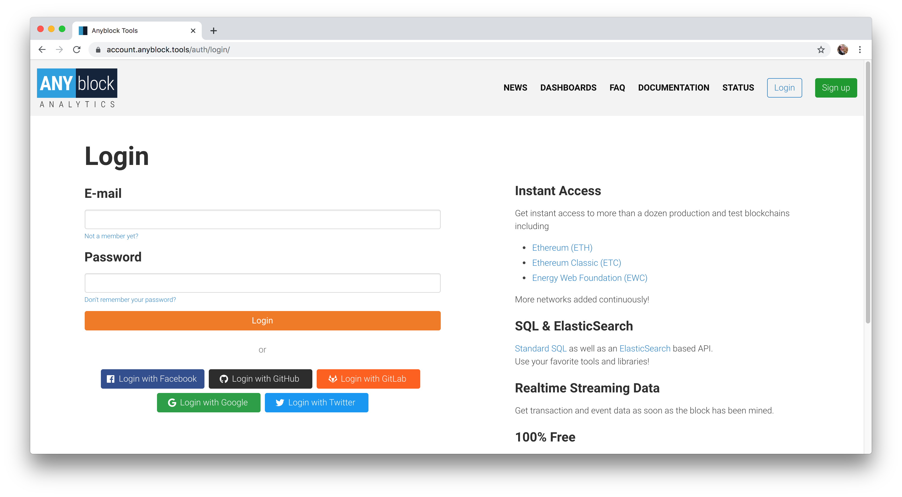
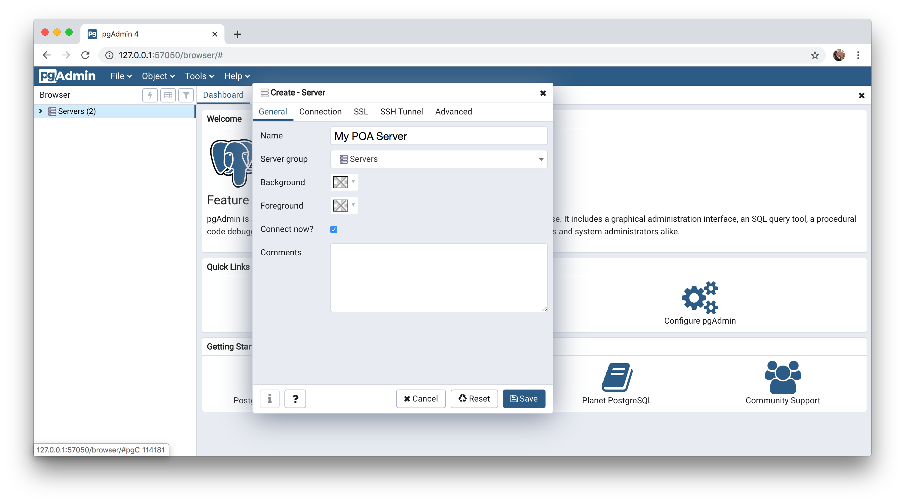
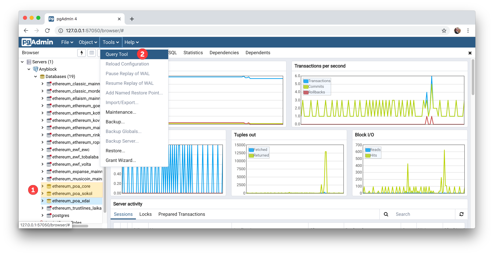
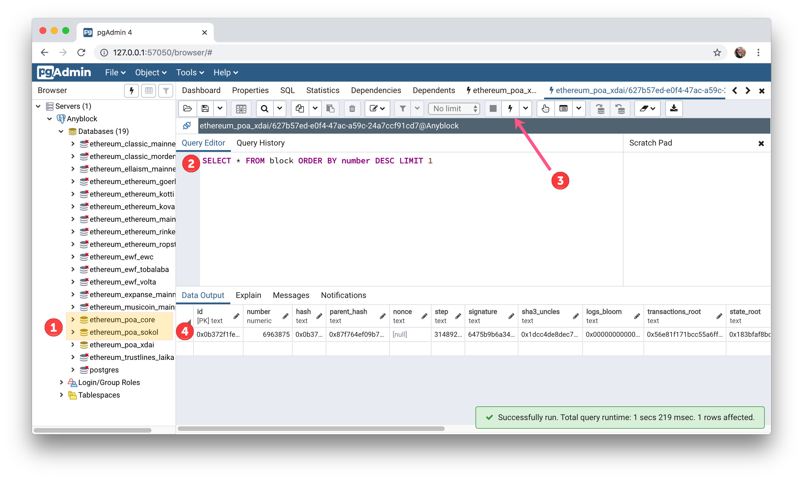

# API & SQL Access

1\) Go to [https://account.anyblock.tools/auth/login/](https://account.anyblock.tools/auth/login/) and sign up for a free account.



2\) You will receive an API key and SQL username/password.  

## ElasticSearch

* Your API key is used to replace `$mytoken` in standard queries. 
* Queries to the xDai chain use the poa eth.events endpoint:
  * Core: [https://api.eth.events/ethereum/poa/core/es/](https://api.eth.events/ethereum/poa/xdai/es/block/search/%20)
  * Sokol Testnet: [https://api.eth.events/ethereum/poa/sokol/es/](https://api.eth.events/ethereum/poa/xdai/es/block/search/%20)
* Example Queries are located here: [https://docs.anyblockanalytics.com/en/latest/elastic/example-queries/index.html](https://docs.anyblockanalytics.com/en/latest/elastic/example-queries/index.html)
* Documentation regarding ElasticSearch API calls is available here: [https://docs.anyblockanalytics.com/en/latest/elastic/index.html](https://docs.anyblockanalytics.com/en/latest/elastic/index.html) 

For example, this curl query will show us data about the last 2 blocks.

```bash
curl -X POST \
https://api.eth.events/ethereum/poa/core/es/block/search/ \
-H 'Authorization: Bearer $mytoken' \
-H 'Content-Type: application/json' \
-d '{
  "sort": {
    "number.num": "desc"
  },
  "size": 2
}'
```

## SQL Access

1\) Download a SQL client Anyblock Analytics suggests [PGAdmin4](https://www.pgadmin.org/download/) 

2\) Click on Server -&gt; Create -&gt; Server 


3\) In the **General** Tab, choose a **Name** for your server instance



4\) Go to the **Connection** Tab, and fill in the information from your AnyBlock Analytics Account and click **Save**:

|  |  |
| :--- | :--- |
| Host name.address | sql.anyblock.tools |
| Port | 45432 |
| Maintenance database | ethereum\_ethereum\_mainnet \(or another db from the list\) |
| Username | _&lt;your\_username&gt;_ |
| Password | _&lt;your\_password&gt;_ |

5\) You will see a list of all databases. 

1. Click on **ethereum\_poa\_core** or **ethereum\_poa\_sokol** to interact with POA data. 
2. To Query the DB, go to Tools -&gt; Query Tool



6\) **Try a Query!**

1. Check you are in the correct POA database.
2. Enter your Query \(this query shows info about the most recent block\).
3. Click the lighting icon to execute.
4. Output from query.



7\) Explore different queries and information in the SQL documentation and tutorials  available here: [https://docs.anyblockanalytics.com/en/latest/sql/tutorials/sql.html](https://docs.anyblockanalytics.com/en/latest/sql/tutorials/sql.html)

**Example query to get transactions to the AMB contract on POA Mainnet**

```text
SELECT * FROM tx
WHERE tx.to = '0xD9a3039cfC70aF84AC9E566A2526fD3b683B995B'
LIMIT 50
```


