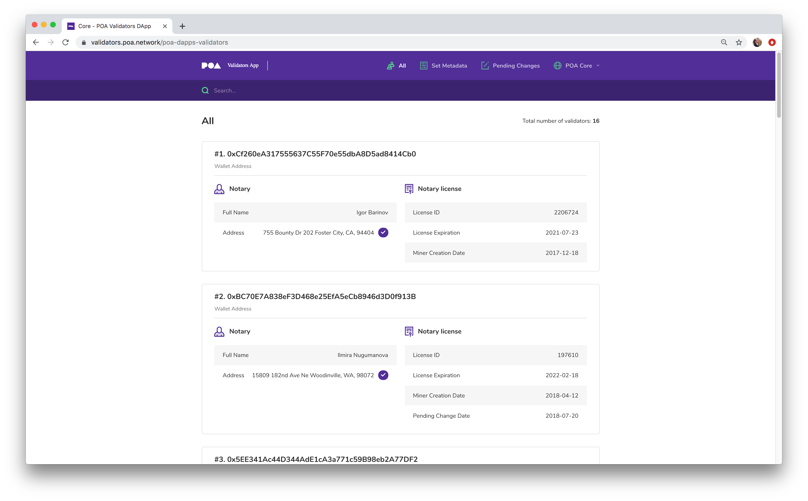

# Governance

In the POA Network, validators manage themselves and the underlying on-chain contracts related to consensus to ensure the network's security and performance. Security of the network is a function of the number of validators on the network, i.e. more validators = greater distribution and security. However, too many validators impacts the performance of the network. 

The goal of POA Network is to maximize the number and distribution of validators \(within the United States\) to secure the network while preserving network performance.

Validator on-chain governance is accomplished through distributed applications \(DApps\) deployed to the network. These DApps allow validators to propose and vote on ballots, increase or decrease the number of votes need to approve a ballot, manage underlying contracts and manage emission funds. 

In addition, validators discuss ideas and present intiatives in the POA forum. Here, new validator candidates may also introduce themselves for possible election to the validator set.

* [Current validators list \(set your network to the POA network\)](https://validators.poa.network/)
* [Active and prior validator voting record \(set your network to the POA network\)](https://voting.poa.network/poa-dapps-voting)
* [POA Validator Forum](https://forum.poa.network/c/poa-core/notaries-intro)
* [Explainer Article](article-a-successful-year-of-on-chain-governance.md)

