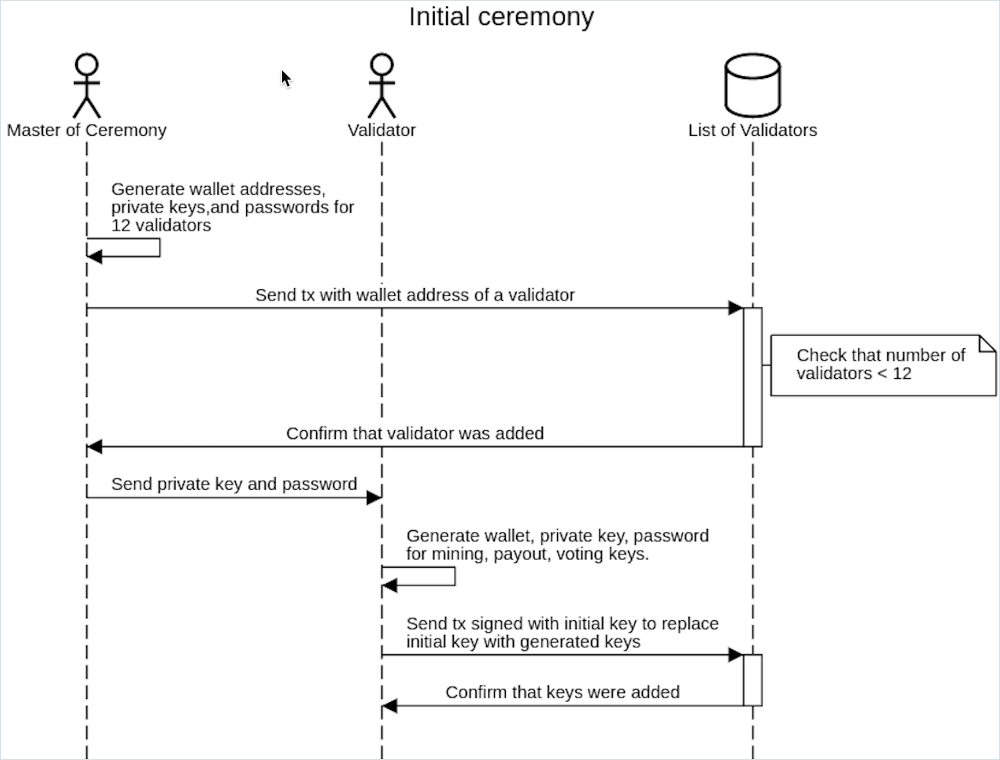

# 初始仪式DApp

在初始仪式中，仪式主持人为每个验证人创建一组密钥。他/她将它们一一分发给验证人。在每次分配密钥之前，他/她将交易发送到带有验证者列表的智能合约。共识算法使用该智能合约来确定验证者是否有权参与共识并创建区块。验证程序的智能合约由其他DApp使用，例如Governance DApp和Payout DApp。

验证器会在初始仪式DApp中生成三个密钥：

* 挖掘密钥，需要参与共识并创建区块。
* 投票密钥，用于创建选票和对选票进行投票。
* 付款密钥，不是必需的。在付款DApp中使用，以将每日开采的硬币从挖掘密钥发送到支付密钥。如果采矿节点受到威胁，攻击者将获得或更少的每日收入。

所有密钥都是在客户端生成的，未经验证者的许可和意愿，不会通过Internet传输。生成密钥后，验证器会将其存储在安全的本地存储中，例如将其保存到硬件钱包，将密码保存到密码管理器。验证者使用仪式主持人提供的初始密钥在验证者的合同上签署交易。

初始仪式是启动基于POA Network独立验证者思想的新网络的必需过程。

