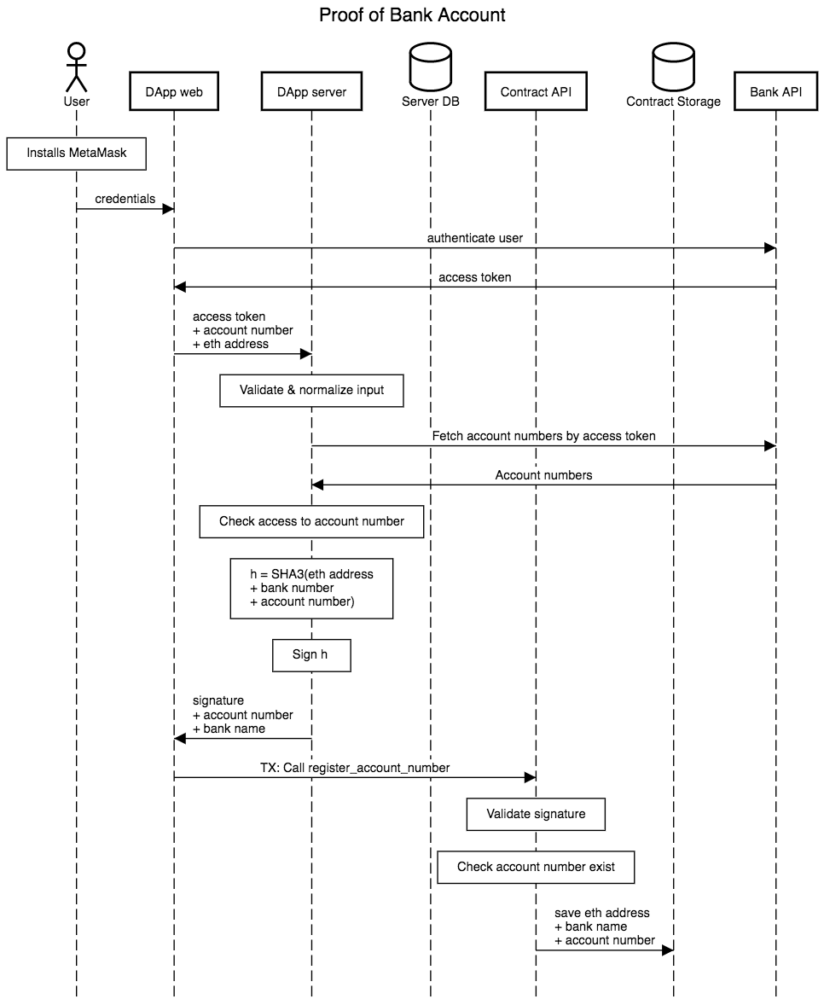

# 银行帐户DApp证明

与其他身份DApp相比，PoBA（从合约的角度来看）是一个一步的验证过程。

DApp客户端和服务器与银行会计API服务（plaid.com）集成在一起。

客户端使用服务的小部件（格子链接 - Plaid Link）对用户进行身份验证，并通过成功的身份验证，将access\_token从格子中返回给客户端。然后，用户用他/她的银行帐号填写表格，并将其与Plaid的访问令牌一起提交到服务器。

服务器由一个Web应用程序和一个连接到区块链的Parity节点组成。该节点在用于部署PoP合约（合约的`所有者`）的以太坊帐户下运行。该帐户需要解锁。

服务器通过删除尾随空格来验证和规范化用户的帐号。然后，服务器使用access\_token从Plaid获取银行帐号。它检查用户提交的帐号是否存在于Plaid返回的列表中。

然后，服务器将用户的`eth地址+银行名称+帐号`合并为一个字符串，并使用SHA-3函数对其进行哈希处理。然后使用`所有者`的私钥对哈希进行签名（这就是为什么需要解锁`所有者`帐户的原因）。

签名，规范化的帐号和银行名称返回给客户。然后，用户在MetaMask中签署交易并调用合约的方法。

合约检查此eth地址的该银行的帐号是否不存在。如果是这样，合同将拒绝该交易。否则，它将以与服务器相同的顺序组合参数，并计算它们的`sha3`哈希。然后，它使用内置的`ecrecover`函数来验证签名属于`所有者`。如果不是，则合约拒绝交易，否则，将信息保存到区块链。

### 可能的作弊

1. _用户可以生成自己的确认代码，计算所有哈希，然后将其提交给合同_，然后进行确认。这无法完成，因为用户不知道`所有者`的私钥，因此无法计算出有效的签名。
2. _用户可以使用由Plaid返回的其他人的access\_token，从而验证他/她没有真正的帐户访问权限_。这等同于黑客入侵他人的计算机或该帐户的所有者有意向用户提供他/她的access\_token。由于与Plaid的所有通信都是通过HTTPS协议进行的，因此用户无法拦截发送给其他人的access\_token。

